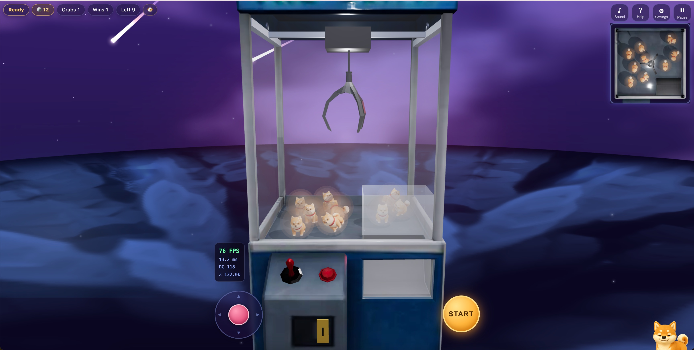

# Claw Machine 3D

A fully client-side 3D claw machine game built with **React 19 + Three.js + Rapier physics**. Aim with the joystick and minimap, drop the claw, and pray your grip holds — the toy can slip mid-carry just like a real arcade machine. Coins, toy collection, achievements, and progress all persist locally; no server required.

## Live Preview

> https://neciszhang.github.io/claw3d/

## Screenshot



## Gameplay

- **Insert a coin** (1 🪙 per grab), move the claw with the joystick / WASD / arrow keys, press **START**
- The three-prong claw physically closes around toys — a toy touched by all three prongs is caught
- Caught ≠ won: the toy **swings while carried and can slip**, driven by your aim accuracy, movement speed, toy weight, and difficulty; slipping near the chute can still luckily roll in
- Two consecutive slips lock the grip: the next catch is guaranteed (pity system)
- Wins pay back 1 🪙 and rarity-based ⭐ stars; check the album for collection and achievements

## Features

### Core experience
- Real rigid-body simulation (Rapier): toy collision, stacking, swinging, slipping
- Aim assist: floor projection ring that turns gold over a catchable toy (toggleable)
- Slip reasons surfaced to the player: off-center grab / moved too fast / weak grip
- Catch / slip / drop-in feedback: claw jolt & bite pause, camera shake & callouts, coin fly-in
- Fast failure recovery: accelerated recall on a miss, skip button, shortened coin animation on replays

### Content & progression (all localStorage, no backend)
- **5 toy variants across 3 rarity tiers** (common / rare / hidden) with distinct color, size, weight, and slip factor
- **Collection album** with owned counts and hidden-toy teasers
- **9 achievements** (first catch, one-shot, 3-streak, lucky roll, no-minimap win…)
- Persistent coin wallet with **daily login bonus**, win rewards, and bankruptcy relief
- Local stats: attempts, wins, fastest time, recent rounds

### Controls & camera
- Virtual joystick (fixed or **follow-finger** mode), keyboard, left-handed layout
- Four-way camera snap + one-tap **front / side / top** presets
- Auto cinematic camera (coin close-up, carry follow) — can be disabled
- Precision slowdown near catchable toys (toggleable)
- Machine **shake** (once per game) to loosen stuck toys

### Extras
- **Photo mode**: hide the UI, frame your shot, export PNG
- **Share card**: canvas-rendered result card download
- Real-time top-down minimap, onboarding tutorial, zh/en i18n
- Auto-pause in background tabs; coin refund if the page closes mid-grab

### Performance
- Toys rendered via `instancedMesh` (per-instance color) — 4 draw calls for all toys
- Expensive shaders (aurora dome, raymarched nebula floor) render into small offscreen targets at reduced refresh rates
- Minimap second pass throttled to every 3rd frame and blitted from a cached texture
- Shadow map freezing when the scene is static, 4 lights total, quality tiers (High / Smooth)
- Vendor chunk splitting (three / rapier / react) for long-term caching

## Tech Stack

| Category | Technology | Version |
| --- | --- | --- |
| UI framework | React + React DOM | ^19.2 |
| 3D rendering | Three.js | ^0.185 |
| React 3D bindings | @react-three/fiber | ^9.7 |
| Physics | @react-three/rapier (Rapier) | ^2.2 |
| 3D helpers | @react-three/drei | ^10.7 |
| State | Zustand | ^5.0 |
| Build | Vite | ^5.4 |
| Types | TypeScript | ^5.6 |

## Getting Started

```bash
# Node.js >= 18
npm install
npm run dev        # dev server (LAN access enabled)
npm run typecheck  # tsc -b
npm run build      # production build to dist/
npm run preview    # preview the dist build
```

## Deployment

Pushing to `main` triggers `.github/workflows/deploy.yml`, which builds and publishes to GitHub Pages. `vite.config.ts` sets `base: '/claw3d/'` for production; adjust `repoName` if you fork under a different repository name.

## Project Structure

```
src/
├── config/gameConfig.ts   # All tunables: physics, claw, grip/slip, toy types, timing, storage keys
├── store/
│   ├── gameStore.ts       # Zustand store: game state machine, wallet, progress, achievements
│   ├── refs.ts            # Per-frame hot data (claw position, phases) bypassing React state
│   └── persistence.ts     # localStorage helpers
├── game/                  # 3D scene: Machine, Claw, Toys (instanced), GrabController,
│                          # CameraRig, MinimapRenderer, Stage (shaders), AimAssist
├── ui/                    # HUD, joystick, modals, settings, album, photo bar
├── audio/soundManager.ts  # WebAudio synth SFX + music loop
├── i18n/                  # zh / en dictionaries
└── utils/                 # capability detection, share card renderer
```

## Tuning

Difficulty and feel are data-driven in `src/config/gameConfig.ts`:

- `GRIP` — slip probability model (base, eccentricity weight, swing hazard, pity threshold)
- `TOY_TYPES` — rarity table: spawn weight, scale, density, slip factor, star reward
- `TIMING` — every phase duration of the grab cycle
- `DIFFICULTY` — claw speed, sensor radius, toy layout per difficulty

## License

MIT
